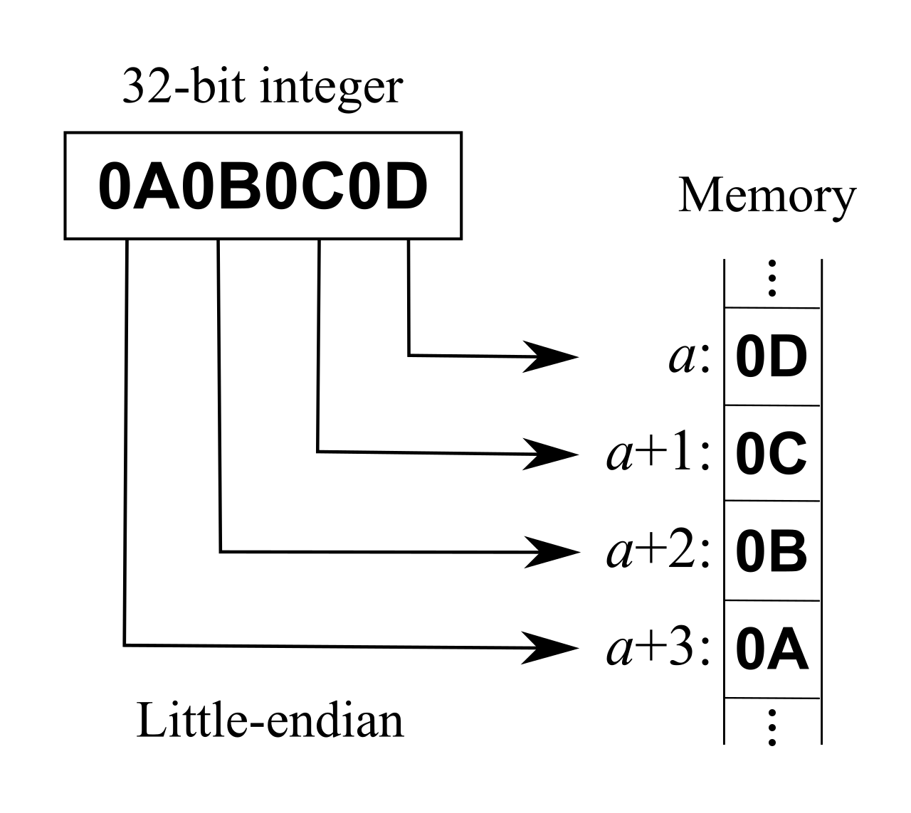

## Intel 架构的基本知识

#### 字节序/端序 Endian

Endian表示数据在内存中的存储顺序,分为大端序和小端序.

大端序: 高位字节存储在内存的低地址中,低位字节存储在内存的高地址中.

  

小端序: 高位字节存储在内存的高地址中,低位字节存储在内存的低地址中.

  

#### 32位环境中的寄存器

通用寄存器有8种,分别是EAX,EBX,ECX,EDX,ESI,EDI,EBP,ESP.用于逻辑运算,数学运算,地址计算,内存指针等.

主要寄存器的用途:

| 寄存器 |                                   用途                                   |
| :----: | :-----------------------------------------------------------------------: |
|  EAX  |                             操作数的运算,结果                             |
|  EBX  |             指向DS段中数据的指针(主要的段寄存器的用途见下图)             |
|  ECX  |                         字符串操作或循环的计数器                         |
|  EDX  |                               输入输出指针                               |
|  ESI  |   指向DS寄存器所指示的段中某个数据的指针,或是字符串操作中字符串的复制源   |
|  EDI  | 指向ES寄存器所指示的段中某个数据的指针,或是字符串操作中字符串的复制目的地 |
|  ESP  |                              栈顶指针(SS段)                              |
|  EBP  |                              栈底指针(SS段)                              |

主要的段寄存器及其用途:

| 寄存器 |       用途       |
| :----: | :--------------: |
|   CS   |   代码段寄存器   |
|   DS   |   数据段寄存器   |
|   SS   |   堆栈段寄存器   |
|   ES   | 附加代码段寄存器 |
|   FS   | 附加代码段寄存器 |
|   GS   | 附加代码段寄存器 |

程序代码放在代码段中,数据放在数据段中,程序所用的栈放在堆栈段中

但是通用寄存器的用途并不限于上面所述,可以用于一般用途,所以上表只能作为参考.

#### 64位环境中的寄存器

64位模式下的通用寄存器在

处理32位操作数时,可以通过RAX/RBX/RCX/RDX/ESI/EBP/ESP/R8D~R15D来访问

处理64位操作数时,可以使用RAX/RBX/RCX/RDX/RDI/RSI/RBP/RSP/R8-R15.
R8D-R15D/R8-R15是8个新的通用寄存器.RIP寄存器是64位指令指针

栈指针和控制寄存器都可以扩展到64位,并增加了CR8寄存器.而且,调试寄存器也可以扩展到64位.
GDTR,IDTR可以扩展到10字节,LDTR,TR可以扩展到64位.

#### 地址

CPU可以通过内存总线访问到的地址称为物理地址,32位模式下最大位64GB,而64位模式下的最大物理地址,Intel当前的实现为$2^{40}$字节,AMD的实现中为$2^{48}$字节.

平坦模式(flat model)中,内存可以看做单一,平坦的连续地址空间,成为线性地址空间.Linux采用这种内存模型.

分段式内存模型中,将内存看做一个个独立的"段"的独立地址空间集合,通过段选择器和偏移量组成的逻辑地址来访问段内地址,首先用段选择器识别出要访问的段,然后通过偏移量找到该段的地址空间中的内存.32位模式下最多能指定16383个段,各段的最大大小为$2^{32}$字节.

64位模式采用了平坦模型,因此可以使用64位线性地址.不能使用分段式内存模型.
